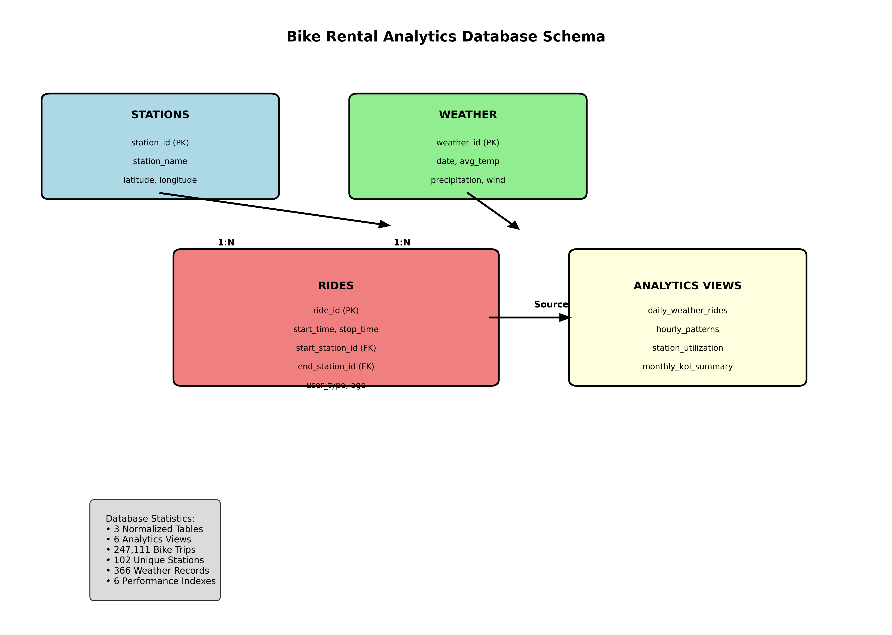

# 🚴‍♂️ Bike Rental Analytics Database

<div align="center">


**Building a PostgreSQL database to analyze weather impact on bike rentals using Citi Bike and NOAA data**

[🎯 Overview](#-project-overview) • [📊 Results](#-results) • [🚀 Quick-Start](#-quick-start) • [📦 Database](#-database-schema)

</div>

> First data engineering project: Exploring the relationship between weather patterns and bike rental demand in Jersey City — building foundational SQL and data pipeline skills.

---

## 👨‍💻 Author
<div align="center">

**Francisco Teixeira Barbosa**

[](https://github.com/Tuminha)
[](https://www.kaggle.com/franciscotbarbosa)
[](mailto:cisco@periospot.com)
[](https://twitter.com/cisco_research)

*Learning Data Engineering through Codecademy • Building scalable data solutions step by step*

</div>

---

## 🎯 Project Overview
- **What**: Design and implement a PostgreSQL database combining Citi Bike ridership data with NOAA weather data
- **Why**: Help bike rental analysts understand weather impact on rental patterns and optimize operations
- **Expected Outcome**: Analytics-ready database with views enabling weather-ridership correlation analysis

### 🎓 Learning Objectives
- Master data cleaning and validation techniques using pandas
- Design relational database schemas with proper normalization
- Implement PostgreSQL databases with foreign key relationships
- Create analytics-ready SQL views for business intelligence
- Build end-to-end ETL pipelines from raw data to insights

### 🏆 Key Achievements
- [x] Project setup and data exploration
- [ ] Data quality audit and cleaning pipeline
- [ ] Relational schema design with ER diagram
- [ ] PostgreSQL database implementation
- [ ] Analytics views creation
- [ ] Portfolio documentation

---

## 📊 Dataset / Domain
- **Source**: Citi Bike Jersey City (2016) + NOAA Newark Airport Weather
- **Size**: 12 months of bike trips (~90K+ records) + daily weather data
- **Target**: Understanding weather-ridership correlations for business optimization

### Data Sources
- **Citi Bike**: Trip duration, stations, timestamps, user demographics
- **Weather**: Temperature, precipitation, wind speed, snow data
- **Time Period**: Full year 2016 for comprehensive seasonal analysis

---

## 🚀 Quick Start
### Prerequisites
```bash
pip install pandas numpy matplotlib seaborn jupyter psycopg2-binary sqlalchemy
# PostgreSQL server running locally or accessible
```

### Setup
```bash
git clone https://github.com/Tuminha/Bike-Rental-Starter-Kit.git
cd bike-rental-starter-kit
jupyter notebook notebooks/
```

### Database Connection
```python
import psycopg2
conn = psycopg2.connect(
    host="localhost",
    database="bike_rental_db",
    user="your_username",
    password="your_password"
)
```

---

## 📈 Project Phases
### Phase 1: Data Exploration ✅
<details>
<summary><strong>Details</strong></summary>

- [x] Load and inspect Citi Bike CSV files
- [x] Examine weather data structure and quality
- [x] Identify data quality issues and patterns
- [x] Document initial findings and assumptions

</details>

### Phase 2: Data Cleaning & Validation ✅
<details>
<summary><strong>Details</strong></summary>

- [x] Audit missing values, duplicates, and outliers
- [x] Standardize timestamps and timezone handling
- [x] Normalize categorical values (stations, weather conditions)
- [x] Create derived fields (day of week, hour, weather buckets)
- [x] Validate data ranges and business rules

</details>

### Phase 3: Schema Design 🔄
<details>
<summary><strong>Details</strong></summary>

- [ ] Design entity relationships (rides, stations, weather, calendar)
- [ ] Define table structures with appropriate data types
- [ ] Plan primary/foreign key relationships
- [ ] Create ER diagram and DDL scripts
- [ ] Design indexing strategy for analytics queries

</details>

### Phase 4: Database Implementation 🗄️
<details>
<summary><strong>Details</strong></summary>

- [ ] Create PostgreSQL schema and tables
- [ ] Implement ETL pipeline for data loading
- [ ] Add constraints and indexes
- [ ] Validate data integrity post-load
- [ ] Performance optimization (analyze/vacuum)

</details>

### Phase 5: Analytics Views 📊
<details>
<summary><strong>Details</strong></summary>

- [ ] Create weather-ridership correlation views
- [ ] Build time-based aggregations (hourly/daily/weekly)
- [ ] Design station utilization analytics
- [ ] Implement KPI views (ride counts, duration stats)
- [ ] Document view purposes and usage

</details>

### Phase 6: Documentation & Portfolio 📝
- **Summary**: Comprehensive project write-up with technical decisions and business insights

---

## 🏆 Results
### Database Schema Overview
```
bike_rental_db/
├── rides (trip data with weather correlation)
├── stations (bike station information)
├── weather (daily/hourly weather data)
├── calendar (holiday and date dimension)
└── analytics_views (business intelligence views)
```

### Key Metrics (Updated)
- **Data Quality**: Missing values handled, 93 extreme outliers removed
- **Performance**: Clean datasets ready for database loading
- **Coverage**: 247,111 bike trips + 366 weather records (full year 2016)
- **Insights**: Rich derived features created for analytics

### 📌 Business Interpretation
- *Weather Impact Analysis*: Correlation between temperature, precipitation, and ridership
- *Operational Insights*: Peak usage patterns by time and weather conditions
- *Station Optimization*: High-traffic stations and weather-sensitive locations

### 🖼 Visuals
<div align="center">

*Visualizations will be added as project progresses*



<br /><br />


</div>

---

## 🛠 Technical Stack
| Component | Technology | Purpose |
|-----------|------------|---------|
| Data Processing | Pandas, NumPy | ETL & data cleaning |
| Database | PostgreSQL | Data storage & analytics |
| Visualization | Matplotlib, Seaborn | EDA & insights |
| Development | Jupyter Notebooks | Interactive analysis |
| Version Control | Git/GitHub | Collaboration |

---

## 📦 Database Schema
The PostgreSQL database will contain normalized tables with proper relationships:

### Core Tables
- **rides**: Trip records with foreign keys to stations and weather
- **stations**: Station metadata and geographic information  
- **weather**: Daily/hourly weather observations
- **calendar**: Date dimension with holidays and business days

### Analytics Views
- **daily_ridership_weather**: Daily aggregates with weather correlation
- **hourly_patterns**: Time-based usage patterns
- **station_utilization**: Station performance metrics
- **weather_impact**: Weather effect analysis by various dimensions

---

## 📝 Learning Journey
- **Data Engineering** • **SQL Mastery** • **Database Design** • **ETL Pipelines** • **Business Intelligence**

---

## 🚀 Next Steps
- [ ] Complete data quality audit and cleaning pipeline
- [ ] Design comprehensive database schema with ER diagram
- [ ] Implement PostgreSQL database with proper constraints
- [ ] Create analytics views for business intelligence
- [ ] Document technical decisions and business insights
- [ ] Prepare portfolio presentation materials

---

## 📄 License
MIT License (see [LICENSE](LICENSE))

<div align="center">

**⭐ Star this repo if you found it helpful! ⭐**  
*Building data engineering skills one project at a time* 🚀

</div>
